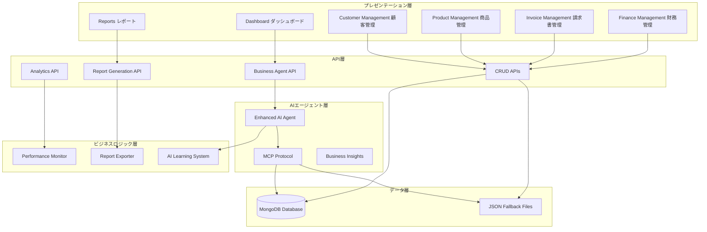
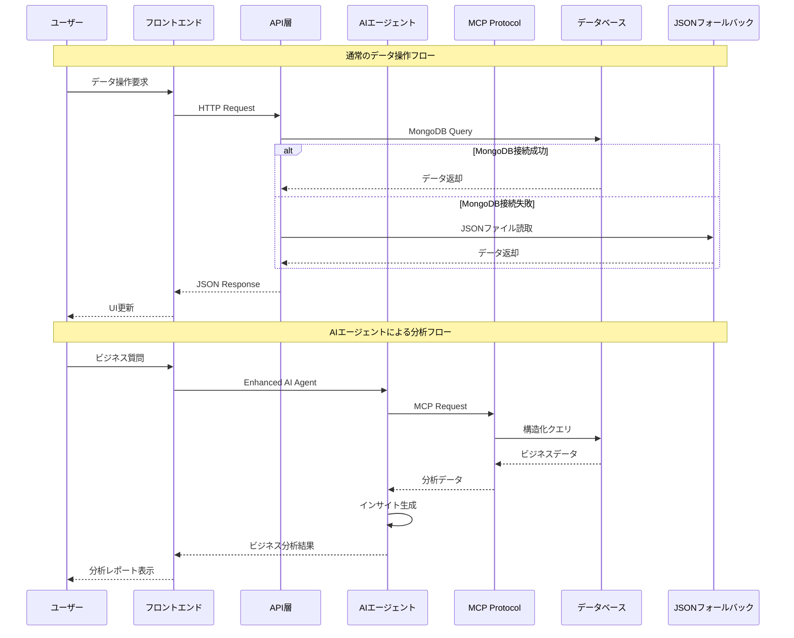
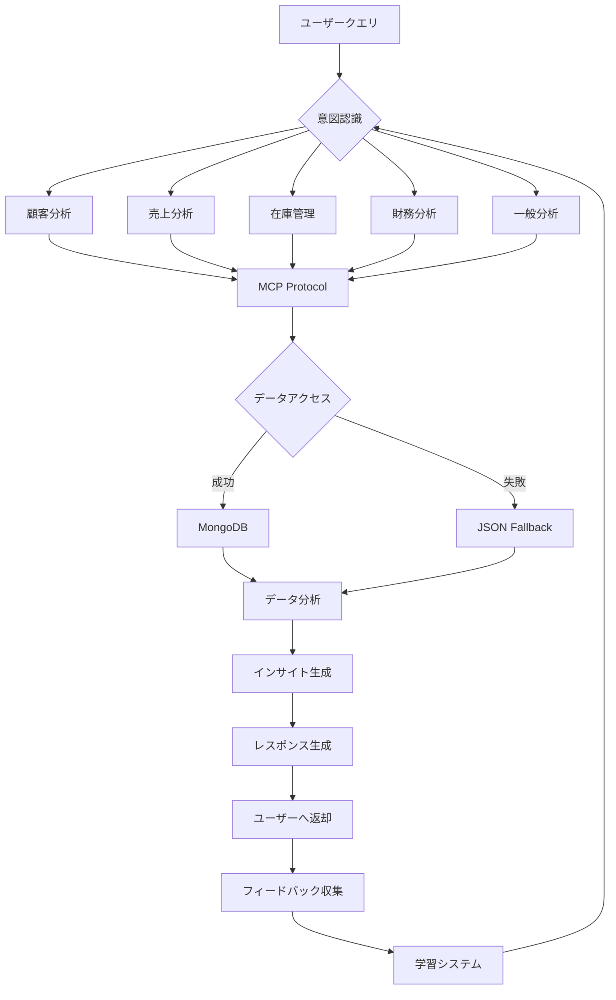
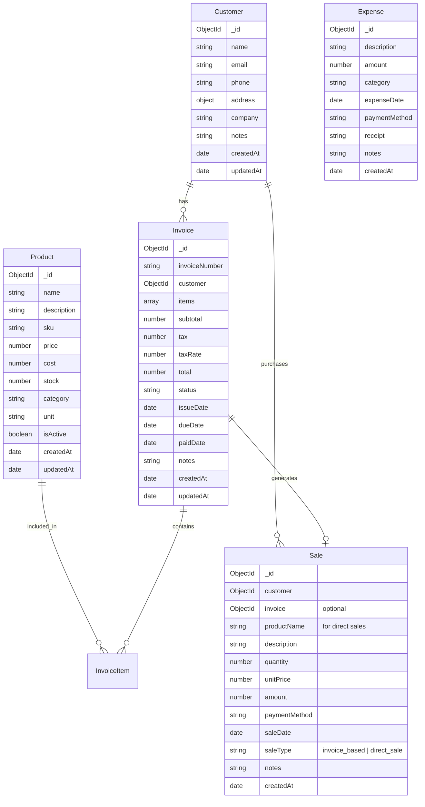
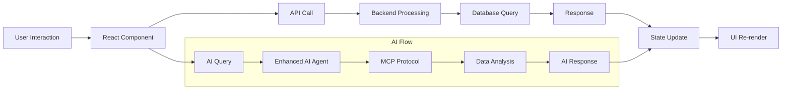

# 🏗️ システム全体アーキテクチャ構造図

## 📋 目次
1. [システム概要](#システム概要)
2. [アーキテクチャ構造](#アーキテクチャ構造)
3. [データフロー](#データフロー)
4. [AI統合アーキテクチャ](#AI統合アーキテクチャ)
5. [データベース構造](#データベース構造)
6. [API設計](#API設計)
7. [フロントエンド構造](#フロントエンド構造)
8. [最近の改善点](#最近の改善点)

---

## 🎯 システム概要

**AI統合ビジネス管理プラットフォーム**は、以下の主要コンポーネントで構成される包括的なビジネス管理システムです：

```
┌─────────────────────────────────────────────────────────────┐
│                    ビジネス管理AIプラットフォーム                    │
├─────────────────────────────────────────────────────────────┤
│  👤 フロントエンド (Next.js + React)                          │
│  🤖 AIエージェント層 (MCP統合)                               │
│  🔗 API層 (RESTful + 業務ロジック)                          │
│  🗄️  データ層 (MongoDB + JSON Fallback)                    │
│  📊 分析・レポート層                                           │
└─────────────────────────────────────────────────────────────┘
```

---

## 🏛️ アーキテクチャ構造

### レイヤー構造



### 主要コンポーネント関係図

```
📱 フロントエンド
├── 🏠 ダッシュボード
│   ├── 📊 統計サマリー
│   ├── 🤖 AIエージェントチャット
│   ├── 📈 リアルタイム監視
│   └── 🚀 クイックアクション
├── 👥 顧客管理
├── 📦 商品・在庫管理
├── 📄 請求書管理
├── 💰 財務管理
│   ├── 💵 売上記録 (独立)
│   ├── 💸 支出記録
│   └── 📊 収支分析
└── 📋 レポート・分析

🤖 AIエージェント統合
├── 🧠 基本AIエージェント (ai-agent.ts)
├── 🚀 拡張AIエージェント (enhanced-ai-agent.ts)
│   ├── 🔗 MCP統合
│   ├── 🛡️ フォールバック機能
│   └── 📊 データ分析機能
├── 📡 MCPデータベース接続 (mcp-database.ts)
└── 🎓 学習システム (ai-learning.ts)

🗄️ データ管理
├── 📊 MongoDBデータベース
│   ├── 👥 顧客 (Customer)
│   ├── 📦 商品 (Product)
│   ├── 📄 請求書 (Invoice)
│   ├── 💰 売上 (Sale) - 独立化
│   └── 💸 支出 (Expense)
└── 📁 JSONフォールバック
    ├── customers.json
    ├── products.json
    ├── sales.json
    └── finances.json
```

---

## 🔄 データフロー

### 1. 通常のデータアクセスフロー
```
ユーザー操作 → フロントエンド → API → データベース → レスポンス → UI更新
```

### 2. AIエージェントによるデータアクセスフロー
```
ユーザー質問 → AI Agent → MCP Protocol → データベース → AI分析 → レスポンス生成
```

### 3. レポート生成フロー
```
レポート要求 → Business Report API → データ集約 → 分析処理 → PDF/Excel生成
```

### データフロー詳細図



---

## 🤖 AI統合アーキテクチャ

### AIエージェント階層構造

```
🧠 AIエージェント統合アーキテクチャ
├── 🎯 Intent Recognition (意図認識)
│   ├── Customer Analysis 顧客分析
│   ├── Sales Analysis 売上分析
│   ├── Inventory Management 在庫管理
│   ├── Financial Reporting 財務レポート
│   └── General Business Insights 一般的ビジネス洞察
├── 🔧 Capability Framework (機能フレームワーク)
│   ├── Data Access データアクセス
│   ├── Analysis Processing 分析処理
│   ├── Report Generation レポート生成
│   └── Recommendation Engine 推奨エンジン
├── 📡 MCP Integration (Model Context Protocol)
│   ├── Database Tools データベースツール
│   │   ├── query_customers 顧客クエリ
│   │   ├── analyze_sales 売上分析
│   │   ├── query_products 商品クエリ
│   │   ├── generate_financial_report 財務レポート
│   │   └── get_business_overview 業務概要
│   └── Fallback Mechanism フォールバック機能
│       ├── JSON Data Analysis JSONデータ分析
│       └── Error Recovery エラー回復
└── 🎓 Learning System (学習システム)
    ├── User Feedback ユーザーフィードバック
    ├── Performance Monitoring パフォーマンス監視
    └── Continuous Improvement 継続的改善
```

### AI処理フロー



---

## 🗄️ データベース構造

### データモデル関係図



### データアクセスパターン

```
📊 データアクセス階層
├── 🔄 Primary Access (MongoDB)
│   ├── CRUD Operations
│   ├── Advanced Queries
│   ├── Aggregation Pipeline
│   └── Real-time Updates
├── 🛡️ Fallback Access (JSON Files)
│   ├── Read-only Operations
│   ├── Static Demo Data
│   ├── Error Recovery
│   └── Development Mode
└── 🔗 MCP Standardized Access
    ├── Tool-based Queries
    ├── Structured Responses
    ├── Error Handling
    └── AI-friendly Format
```

---

## 🔌 API設計

### API エンドポイント構造

```
🌐 API アーキテクチャ
├── 🤖 /api/business-agent
│   ├── POST /chat - AIエージェントとの会話
│   └── GET /capabilities - 利用可能機能一覧
├── 👥 /api/customers
│   ├── GET / - 顧客一覧取得
│   ├── POST / - 顧客作成
│   ├── GET /[id] - 顧客詳細取得
│   ├── PUT /[id] - 顧客更新
│   └── DELETE /[id] - 顧客削除
├── 📦 /api/products
│   ├── GET / - 商品一覧取得
│   ├── POST / - 商品作成
│   ├── GET /[id] - 商品詳細取得
│   ├── PUT /[id] - 商品更新
│   └── DELETE /[id] - 商品削除
├── 📄 /api/invoices
│   ├── GET / - 請求書一覧取得
│   ├── POST / - 請求書作成
│   ├── GET /[id] - 請求書詳細取得
│   ├── PUT /[id] - 請求書更新
│   └── DELETE /[id] - 請求書削除
├── 💰 /api/sales
│   ├── GET / - 売上一覧取得
│   ├── POST / - 売上記録作成 (請求書なしでも可能)
│   ├── GET /[id] - 売上詳細取得
│   └── DELETE /[id] - 売上削除
├── 💸 /api/expenses
│   ├── GET / - 支出一覧取得
│   ├── POST / - 支出記録作成
│   ├── GET /[id] - 支出詳細取得
│   ├── PUT /[id] - 支出更新
│   └── DELETE /[id] - 支出削除
├── 📊 /api/analytics
│   ├── GET /dashboard - ダッシュボード統計
│   ├── GET /sales-trends - 売上トレンド
│   ├── GET /customer-analysis - 顧客分析
│   └── GET /financial-summary - 財務サマリー
└── 📋 /api/business-report
    ├── POST /generate - レポート生成
    ├── GET /export/[format] - レポートエクスポート
    └── GET /templates - レポートテンプレート
```

### APIレスポンス標準化

```typescript
// 標準APIレスポンス形式
interface APIResponse<T> {
  success: boolean
  data?: T
  error?: {
    message: string
    code: string
    timestamp: string
  }
  metadata?: {
    page?: number
    limit?: number
    total?: number
  }
}
```

---

## 🎨 フロントエンド構造

### コンポーネント階層

```
🎨 フロントエンド アーキテクチャ
├── 📱 Pages (app/ directory)
│   ├── 🏠 / → /dashboard (自動リダイレクト)
│   ├── 📊 /dashboard - メインダッシュボード
│   ├── 👥 /customers - 顧客管理
│   ├── 📦 /products - 商品管理
│   ├── 📄 /invoices - 請求書管理
│   ├── 💰 /finances - 財務管理
│   └── 📋 /reports - レポート・分析
├── 🧩 Components (components/ directory)
│   ├── 🤖 BusinessAIAgent.tsx - AIエージェントチャット
│   ├── 🚀 AIQuickActions.tsx - クイックアクション
│   ├── 📊 RealTimeBusinessMonitor.tsx - リアルタイム監視
│   ├── 📈 PerformanceMonitorDashboard.tsx - パフォーマンス監視
│   ├── 📋 BusinessReportViewer.tsx - レポート表示
│   ├── 📤 ReportExportModal.tsx - レポートエクスポート
│   ├── 🧭 Navigation.tsx - ナビゲーション
│   └── 🎨 ui/ - 基本UIコンポーネント
└── 📚 Library (lib/ directory)
    ├── 🤖 ai-agent.ts - 基本AIエージェント
    ├── 🚀 enhanced-ai-agent.ts - 拡張AIエージェント
    ├── 📡 mcp-database.ts - MCPデータベース接続
    ├── 🎓 ai-learning.ts - AI学習システム
    ├── 📊 business-report.ts - レポート生成
    ├── 📈 performance-monitor.ts - パフォーマンス監視
    ├── 📤 report-exporter.ts - レポートエクスポート
    ├── 🗄️ database.ts - データベース接続
    ├── 📋 models.ts - データモデル
    └── 🛠️ utils.ts - ユーティリティ
```

### 状態管理とデータフロー



---

## 🔧 最近の改善点

### 1. AIエージェントMCP統合 (2024年12月)

**問題**: AIエージェントが正しい情報を出力できていない
**解決**: Enhanced AI Agentへのアップグレード

```typescript
// Before: 基本的なAIエージェント
import { processBusinessQuery } from '@/lib/ai-agent'

// After: MCP統合エージェント
import { processEnhancedBusinessQuery } from '@/lib/enhanced-ai-agent'
```

**改善内容**:
- ✅ MCP (Model Context Protocol) 統合
- ✅ データベースアクセス機能強化
- ✅ フォールバック機能追加
- ✅ エラーハンドリング改善

### 2. データベース分離 (2024年12月)

**要求**: 請求書と売上のDB分離、売上を独立して追加可能に

**変更内容**:
```typescript
// Sale モデルの改善
const SaleSchema = new mongoose.Schema({
  invoice: {
    type: mongoose.Schema.Types.ObjectId,
    ref: 'Invoice',
    required: false  // 請求書と売上を分離 - invoiceは任意に
  },
  // 売上タイプの追加
  saleType: {
    type: String,
    enum: ['invoice_based', 'direct_sale'],
    default: 'direct_sale'
  },
  // 請求書なしでの売上情報
  productName: String,
  quantity: Number,
  unitPrice: Number,
  // ... その他のフィールド
})
```

**実装された機能**:
- ✅ 請求書なしでの売上記録
- ✅ 直接売上作成機能
- ✅ 売上タイプ分類 (invoice_based / direct_sale)
- ✅ 財務管理ページでの売上追加UI

### 3. システム統合テスト実装

**追加されたテスト機能**:
- ✅ MCP統合テスト
- ✅ AI接続テスト
- ✅ データベース接続テスト
- ✅ 売上・請求書分離テスト

---

## 📈 システムパフォーマンス

### 監視項目

```
🔍 パフォーマンス監視
├── ⚡ システムリソース
│   ├── CPU使用率
│   ├── メモリ使用量
│   ├── ディスク使用量
│   └── ネットワーク帯域
├── 🌐 アプリケーション
│   ├── API応答時間
│   ├── データベースクエリ時間
│   ├── AI処理時間
│   └── ページ読み込み時間
├── 👥 ユーザーエクスペリエンス
│   ├── ページビュー数
│   ├── セッション時間
│   ├── エラー発生率
│   └── AI活用率
└── 🤖 AI機能
    ├── 質問処理数
    ├── 回答精度
    ├── 学習データ蓄積
    └── フィードバック率
```

---

## 🚀 今後の拡張予定

### 計画中の機能

1. **📱 モバイル対応強化**
   - レスポンシブデザイン最適化
   - PWA対応

2. **🔗 外部システム連携**
   - 会計ソフト連携
   - 決済システム統合
   - ECプラットフォーム連携

3. **🧠 AI機能拡張**
   - 予測分析機能
   - 自動化推奨
   - 異常検知

4. **📊 分析機能強化**
   - 高度なダッシュボード
   - カスタムレポート
   - データ可視化

---

## 📞 サポート・お問い合わせ

システムについてご質問がございましたら、以下の方法でお問い合わせください：

- 📧 **技術サポート**: GitHub Issues
- 📚 **ドキュメント**: `/docs/` ディレクトリ
- 🔧 **開発者向け**: `README.md`

---

**最終更新**: 2024年12月8日  
**文書バージョン**: 1.0.0  
**対象システム**: AI統合ビジネス管理プラットフォーム v1.0.0