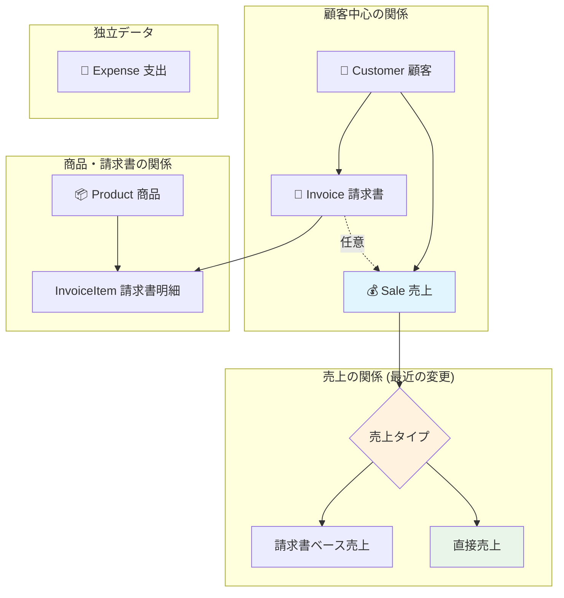

# 🎯 システム全体構造・関係性まとめ

## 📋 はじめに

このドキュメントは、AI統合ビジネス管理プラットフォームの現在のシステム構造と各コンポーネントの関係性を分かりやすく説明します。

---

## 🏗️ 現在のシステム構成

### システム全体図

```
┌─────────────────────────────────────────────────────────────┐
│                    👤 ユーザーインターフェース                     │
│  ┌─────────┐ ┌─────────┐ ┌─────────┐ ┌─────────┐ ┌─────────┐  │
│  │ダッシュ │ │顧客管理│ │商品管理│ │請求書  │ │財務管理│  │
│  │ボード  │ │       │ │       │ │       │ │       │  │
│  └─────────┘ └─────────┘ └─────────┘ └─────────┘ └─────────┘  │
└─────────────────────┬───────────────────────────────────────┘
                     │ HTTP Requests
┌─────────────────────▼───────────────────────────────────────┐
│                    🔗 API層 (Next.js)                       │
│  ┌─────────────┐ ┌─────────────┐ ┌─────────────┐           │
│  │ビジネス     │ │CRUD APIs   │ │分析・レポート│           │
│  │エージェント │ │(顧客/商品等)│ │APIs        │           │
│  │API         │ │           │ │           │           │
│  └─────────────┘ └─────────────┘ └─────────────┘           │
└─────────────────────┬───────────────────────────────────────┘
                     │ 
┌─────────────────────▼───────────────────────────────────────┐
│                    🤖 AI処理層                              │
│  ┌─────────────────┐ ┌─────────────────┐                  │
│  │Enhanced AI Agent│ │MCP Protocol     │                  │
│  │(拡張AIエージェント) │ │(データアクセス)  │                  │
│  └─────────────────┘ └─────────────────┘                  │
└─────────────────────┬───────────────────────────────────────┘
                     │ 
┌─────────────────────▼───────────────────────────────────────┐
│                    🗄️ データ層                              │
│  ┌─────────────────┐ ┌─────────────────┐                  │
│  │MongoDB Database │ │JSON Fallback    │                  │
│  │(メインデータ)    │ │(バックアップ)    │                  │
│  └─────────────────┘ └─────────────────┘                  │
└─────────────────────────────────────────────────────────────┘
```

---

## 📊 データ構造と関係性

### 現在のデータベース構造

```
🗄️ データベース構造
├── 👥 Customer (顧客)
│   ├── 基本情報: 名前、メール、電話番号
│   ├── 住所情報: 住所、都市、郵便番号
│   └── 関連: 請求書、売上記録
├── 📦 Product (商品)
│   ├── 基本情報: 名前、説明、SKU
│   ├── 価格情報: 価格、コスト
│   ├── 在庫情報: 在庫数、単位
│   └── 関連: 請求書アイテム
├── 📄 Invoice (請求書)
│   ├── 基本情報: 請求書番号、顧客
│   ├── 明細: 商品、数量、価格
│   ├── 金額: 小計、税額、合計
│   ├── 日付: 発行日、支払期日、支払日
│   └── 関連: 顧客、売上記録
├── 💰 Sale (売上) ★最近の変更★
│   ├── 基本情報: 顧客、売上日
│   ├── 商品情報: 商品名、数量、単価
│   ├── 金額: 売上金額、支払方法
│   ├── 売上タイプ: 請求書ベース / 直接売上
│   └── 関連: 顧客、請求書(任意)
└── 💸 Expense (支出)
    ├── 基本情報: 説明、金額、カテゴリ
    ├── 日付: 支出日
    ├── 支払情報: 支払方法、領収書
    └── 関連: なし (独立)
```

### データの関係性



---

## 🤖 AI統合アーキテクチャ

### AIエージェントの構成

```
🧠 AI処理の流れ
┌─────────────────────────────────────────────────────────────┐
│ 1. ユーザーからの質問                                          │
│    "顧客データの概要を教えてください"                           │
└─────────────────────┬───────────────────────────────────────┘
                     │
┌─────────────────────▼───────────────────────────────────────┐
│ 2. Enhanced AI Agent (拡張AIエージェント)                     │
│    ├── 質問の意図を分析                                      │
│    ├── 適切なデータアクセス手法を選択                          │
│    └── MCP Protocol を通じてデータ取得                       │
└─────────────────────┬───────────────────────────────────────┘
                     │
┌─────────────────────▼───────────────────────────────────────┐
│ 3. MCP (Model Context Protocol)                            │
│    ├── query_customers (顧客クエリ)                         │
│    ├── analyze_sales (売上分析)                             │
│    ├── query_products (商品クエリ)                          │
│    ├── generate_financial_report (財務レポート)             │
│    └── get_business_overview (業務概要)                     │
└─────────────────────┬───────────────────────────────────────┘
                     │
┌─────────────────────▼───────────────────────────────────────┐
│ 4. データアクセス                                            │
│    ├── MongoDB (成功時)                                     │
│    └── JSON Fallback (失敗時)                              │
└─────────────────────┬───────────────────────────────────────┘
                     │
┌─────────────────────▼───────────────────────────────────────┐
│ 5. 分析結果をユーザーに返却                                   │
│    ├── ビジネス分析レポート                                  │
│    ├── 日本語での説明                                       │
│    └── 具体的な数値データ                                    │
└─────────────────────────────────────────────────────────────┘
```

### AIエージェントの改善点 (最近の変更)

**以前の問題:**
- ❌ 基本AIエージェント使用
- ❌ データベースアクセス失敗時にエラー
- ❌ 500エラーが発生

**現在の改善:**
- ✅ 拡張AIエージェント使用
- ✅ MCP統合によるデータアクセス
- ✅ フォールバック機能
- ✅ エラー時もJSONデータで分析継続

---

## 🔄 主要な機能フロー

### 1. 顧客管理フロー

```
👥 顧客登録・管理
├── 新規顧客登録
│   ├── フォーム入力
│   ├── API: POST /api/customers
│   ├── データベース保存
│   └── 一覧更新
├── 顧客情報表示
│   ├── API: GET /api/customers
│   ├── データ取得
│   └── テーブル表示
└── 顧客編集・削除
    ├── 編集フォーム
    ├── API: PUT/DELETE /api/customers/[id]
    └── データ更新
```

### 2. 売上管理フロー (最近の変更)

```
💰 売上記録・管理 (改善された機能)
├── 請求書ベース売上
│   ├── 請求書作成
│   ├── 支払い完了
│   └── 売上記録自動生成
└── 直接売上 ★新機能★
    ├── 売上フォーム入力
    │   ├── 顧客選択
    │   ├── 商品名入力
    │   ├── 数量×単価
    │   └── 合計自動計算
    ├── API: POST /api/sales
    ├── データベース保存
    └── 財務データ更新
```

### 3. AIエージェント活用フロー

```
🤖 AI分析・質問対応
├── ユーザーからの質問
│   ├── チャットインターフェース
│   └── 自然言語入力
├── AI処理
│   ├── Enhanced AI Agent
│   ├── MCP Protocol
│   ├── データ取得・分析
│   └── インサイト生成
└── 結果表示
    ├── 日本語レポート
    ├── データ可視化
    └── 推奨アクション
```

---

## 📁 重要なファイル構成

### フロントエンド (app/)

```
📱 フロントエンド構成
├── app/
│   ├── page.tsx (ホームページ → ダッシュボードへリダイレクト)
│   ├── layout.tsx (全体レイアウト + ナビゲーション)
│   ├── dashboard/page.tsx (メインダッシュボード)
│   ├── customers/page.tsx (顧客管理)
│   ├── products/page.tsx (商品管理)
│   ├── invoices/page.tsx (請求書管理)
│   ├── finances/page.tsx (財務管理) ★最近更新★
│   └── api/ (APIエンドポイント)
│       ├── business-agent/route.ts ★最近更新★
│       ├── customers/route.ts
│       ├── products/route.ts
│       ├── invoices/route.ts
│       ├── sales/route.ts ★最近更新★
│       └── expenses/route.ts
```

### バックエンドロジック (lib/)

```
🔧 バックエンド構成
├── lib/
│   ├── models.ts (データベースモデル) ★最近更新★
│   ├── database.ts (DB接続・フォールバック)
│   ├── ai-agent.ts (基本AIエージェント)
│   ├── enhanced-ai-agent.ts (拡張AIエージェント) ★最近追加★
│   ├── mcp-database.ts (MCP統合) ★最近追加★
│   ├── ai-learning.ts (AI学習システム)
│   ├── business-report.ts (レポート生成)
│   ├── performance-monitor.ts (パフォーマンス監視)
│   └── report-exporter.ts (レポートエクスポート)
```

### コンポーネント (components/)

```
🧩 コンポーネント構成
├── components/
│   ├── Navigation.tsx (メインナビゲーション)
│   ├── BusinessAIAgent.tsx (AIエージェントチャット)
│   ├── AIQuickActions.tsx (クイックアクション)
│   ├── RealTimeBusinessMonitor.tsx (リアルタイム監視)
│   ├── PerformanceMonitorDashboard.tsx (パフォーマンス)
│   ├── BusinessReportViewer.tsx (レポート表示)
│   ├── ReportExportModal.tsx (エクスポート機能)
│   └── ui/ (基本UIコンポーネント)
```

---

## 🎯 現在のシステムの特徴

### 強化された機能

1. **🤖 AI統合**
   - Enhanced AI Agent によるインテリジェントな対応
   - MCP Protocol による標準化されたデータアクセス
   - フォールバック機能による高い可用性

2. **💰 柔軟な売上管理** 
   - 請求書ベースと直接売上の両方に対応
   - 売上データの独立管理
   - 簡単な売上入力機能

3. **📊 包括的な分析**
   - リアルタイムビジネス監視
   - パフォーマンス監視
   - 自動レポート生成

4. **🛡️ 堅牢性**
   - データベース接続失敗時のJSONフォールバック
   - エラーハンドリングの強化
   - 継続的なサービス提供

### 技術的な利点

- **モダンなアーキテクチャ**: Next.js 15 + React + TypeScript
- **スケーラブルなデータ層**: MongoDB + JSONフォールバック
- **AIファースト設計**: ビジネス運営をAIが支援
- **ユーザーフレンドリー**: 日本語インターフェース + 直感的なUI

---

## 🚀 今後の活用方法

### 日常業務での活用

1. **📊 毎日のダッシュボード確認**
   - 売上状況の把握
   - 在庫状況の監視
   - 重要指標のチェック

2. **🤖 AIエージェントへの質問**
   - 「今月の売上はどうですか？」
   - 「在庫が少ない商品は？」
   - 「顧客満足度を上げるには？」

3. **💰 売上・支出の記録**
   - 請求書なしでも売上記録可能
   - 支出の分類・管理
   - 財務状況の把握

4. **📋 レポート活用**
   - 月次・年次レポートの生成
   - PDFやExcelでの出力
   - 経営判断材料として活用

---

## 📞 システムサポート

何かご不明な点がございましたら、以下をご参照ください：

- 📚 **詳細ドキュメント**: `docs/SYSTEM_ARCHITECTURE_JP.md`
- 🔧 **技術情報**: `README.md`
- 💡 **使い方ガイド**: システム内のヘルプ機能

---

**作成日**: 2024年12月8日  
**システム名**: AI統合ビジネス管理プラットフォーム  
**バージョン**: 1.0.0